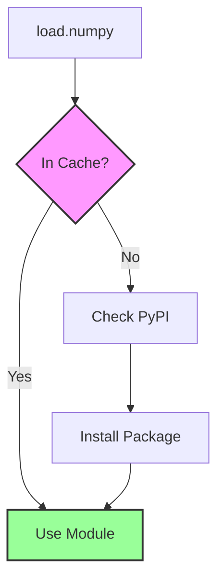
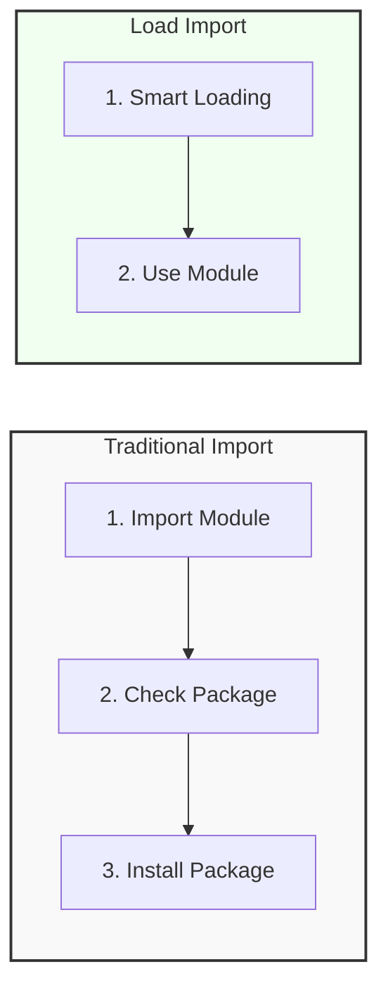
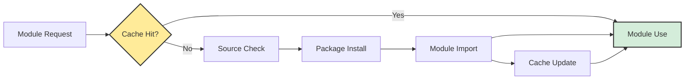
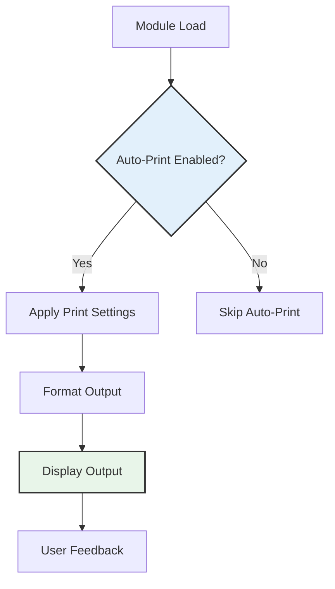

# 📊 Load Architecture Diagrams

## 📈 Import Flow

### ASCII Version
```
+-------------------+
|     Python Code   |
+-------------------+
          |
          v
+-------------------+
|     load.load()   |
+-------------------+
          |
          v
+-------------------+
|  Registry Check   |
|  (PyPI, Local,    |
|   StdLib)         |
+-------------------+
          |
          v
+-------------------+
|    Module Cache   |
|  (RAM Caching)    |
+-------------------+
          |
          v
+-------------------+
|     Module Use    |
+-------------------+
```

### Mermaid Version
```mermaid
flowchart TD
    A[Python Code] --> B[load.load()]
    B --> C[Registry Check]
    C --> D[Module Cache]
    D --> E[Module Use]
    
    subgraph Registry Types
    C1[PyPI]
    C2[Local]
    C3[StdLib]
    end
    
    C --> C1
    C --> C2
    C --> C3
```

## 📦 Package Resolution

### ASCII Version
```
+-------------------+
|     load.numpy    |
+-------------------+
          |
          v
+-------------------+
|  Check Cache      |
+-------------------+
          |
          v
+-------------------+
|  Check PyPI       |
+-------------------+
          |
          v
+-------------------+
|  Install Package  |
+-------------------+
          |
          v
+-------------------+
|     Use Module    |
+-------------------+
```

### Mermaid Version


## 🔄 Performance Comparison

### ASCII Version
```
+-------------------+     +-------------------+
| Traditional Import|     |  Load Import      |
+-------------------+     +-------------------+
          |                     |
          v                     v
+-------------------+     +-------------------+
|  Multiple Steps   |     |     Single Step   |
|                   |     |                   |
|  Import Module    |     | Smart Loading     |
|  Check Package    |     | Cache Check       |
|  Install Package  |     | Use Module        |
+-------------------+     +-------------------+
```

### Mermaid Version


## 📊 Import Types

### ASCII Version
```
+-------------------+
|     load.load()   |
+-------------------+
          |
          v
+-------------------+
|    Source Types   |
+-------------------+
          |
          v
+-------------------+     +-------------------+     +-------------------+
|    PyPI Package   |     |  Local File       |     |  Standard Library |
+-------------------+     +-------------------+     +-------------------+
          |                     |                     |
          v                     v                     v
+-------------------+     +-------------------+     +-------------------+
|                   |     |                   |     |                   |
|    Install        |     |    Load File      |     |    Load Module    |
|    and Import     |     |                   |     |                   |
+-------------------+     +-------------------+     +-------------------+
          |                     |                     |
          v                     v                     v
+-------------------+     +-------------------+     +-------------------+
|                   |     |                   |     |                   |
|     Use Module    |     |     Use Module    |     |     Use Module    |
|                   |     |                   |     |                   |
+-------------------+     +-------------------+     +-------------------+
```

### Mermaid Version
```mermaid
flowchart TD
    A[load.load()] --> B{Source Type}
    B -->|PyPI| C[Install and Import]
    B -->|Local| D[Load File]
    B -->|StdLib| E[Load Module]
    
    C --> F[Use Module]
    D --> F
    E --> F
    
    style B fill:#e6f3ff,stroke:#333,stroke-width:2px
    style F fill:#e6ffe6,stroke:#333,stroke-width:2px
```

## 📱 Module Lifecycle

### ASCII Version
```
+-------------------+
|    Module Request |
+-------------------+
          |
          v
+-------------------+
|    Cache Check    |
+-------------------+
          |
          v
+-------------------+
|    Source Check   |
+-------------------+
          |
          v
+-------------------+
|    Package Install|
+-------------------+
          |
          v
+-------------------+
|    Module Import  |
+-------------------+
          |
          v
+-------------------+
|    Cache Update   |
+-------------------+
          |
          v
+-------------------+
|    Module Use     |
+-------------------+
```

### Mermaid Version


## 🔄 Auto-Print Flow

### ASCII Version
```
+-------------------+
|    Module Load    |
+-------------------+
          |
          v
+-------------------+
|    Auto-Print     |
|    Configuration  |
+-------------------+
          |
          v
+-------------------+
|    Print Settings |
+-------------------+
          |
          v
+-------------------+
|    Output Display |
+-------------------+
          |
          v
+-------------------+
|    User Feedback  |
+-------------------+
```

### Mermaid Version

